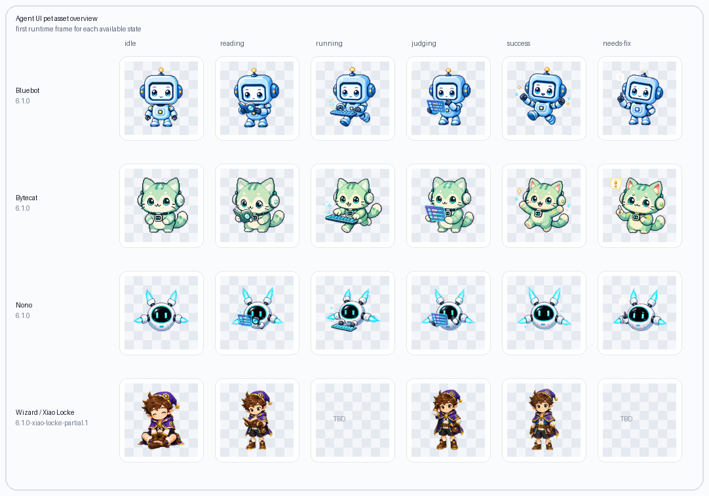
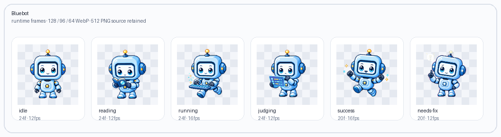
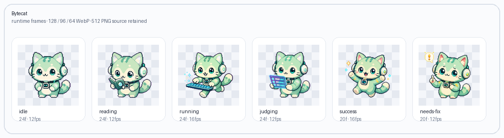
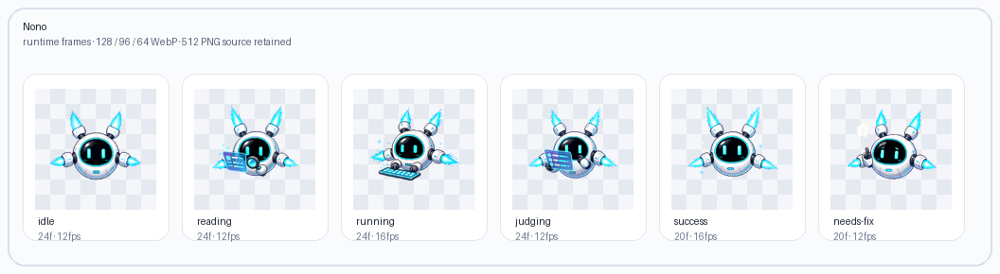
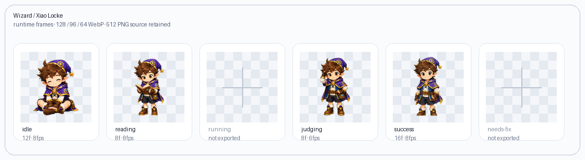

# Agent UI Asset

Coding Coach / Agent UI 宠物素材仓库。这里保留前端可直接接入的 runtime 序列帧、可追溯的 512 PNG 源帧，以及用于本地检查的静态预览器。



## 素材概览

| UI | 状态 | Runtime | Source PNG | 说明 |
| --- | --- | --- | --- | --- |
| Bluebot | 6 个状态 + 4 个转场 | `outputs/bluebot-sequence-v6-1-runtime/` | `outputs/bluebot-sequence-v6-full-frame-acting-v6-1/` | 默认宠物，动作克制稳定 |
| Bytecat | 6 个状态 + 4 个转场 | `outputs/bytecat-sequence-v6-1-runtime/` | `outputs/bytecat-sequence-v6-full-frame-acting-v6-1/` | 个性宠物，轮廓更活泼 |
| Nono | 6 个状态 + 4 个转场 | `outputs/nono-sequence-v6-1-runtime/` | `outputs/nono-sequence-v6-full-frame-acting-v6-1/` | 悬浮扫描风格，适合科技感 UI |
| Wizard / 小洛克 | 4 个状态 | `outputs/wizard-sequence-v6-1-runtime/` | `outputs/wizard-sequence-v6-full-frame-acting-v6-1/` | 当前缺 `running` 和 `needs-fix` |

## UI 素材图

### Bluebot



### Bytecat



### Nono



### Wizard / 小洛克



## 资源包结构

前端集成优先使用 runtime 包。runtime 包只保留运行所需的 WebP 序列帧：

```text
outputs/<skin>-sequence-v6-1-runtime/
  manifest.json
  128/
  96/
  64/
```

Source PNG 包用于审核、二次导出和后续素材生产：

```text
outputs/<skin>-sequence-v6-full-frame-acting-v6-1/
  manifest.json
  512/
```

## 状态语义

| 状态 | UI 含义 |
| --- | --- |
| `idle` | 默认空闲、等待、用户正在编辑 |
| `reading` | Agent 正在读取题目、上下文、记忆或计划 |
| `running` | Agent 正在运行样例或临时检查 |
| `judging` | 正式提交已创建，正在等待 Judge 结果 |
| `success` | Accepted、命令成功或 Agent 动作完成 |
| `needs-fix` | Wrong Answer、Runtime Error、Time Limit Exceeded、System Error 或命令失败 |

## 本地预览

在仓库根目录启动静态服务：

```bash
python3 -m http.server 8765 --bind 127.0.0.1
```

然后打开：

```text
http://127.0.0.1:8765/viewer/index.html
```

预览器可以在 runtime 和 source PNG 包之间切换，用于检查透明底、状态帧、转场帧和不同尺寸的实际显示效果。

## 设计约束

- 图片必须是透明背景。
- 重要像素应留在 512 画布中央 80% 安全区内。
- 不允许出现文字、Logo、代码截图、UI 截图、水印、隐藏用例暗示或正确性保证符号。
- `needs-fix` 必须是支持性提示，不能表现为责备、嘲讽或失败羞辱。
- `judging` 只能表达“等待系统返回结果”，不能暗示宠物提前知道答案。
